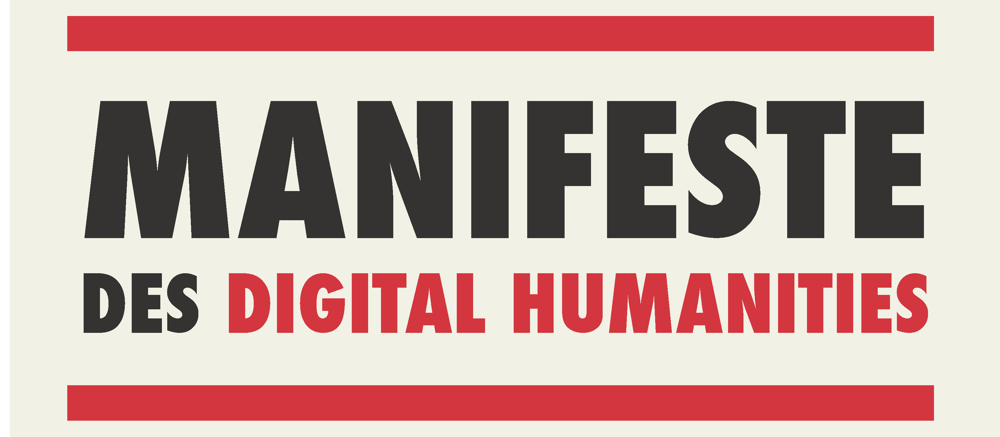

---
authors:
  - Charles Pletcher
exports:
  - format: typst
    template: lapreprint-typst
    output: exports/syllabus.pdf
    articles:
      - file: schedule.md
        title: Course Schedule
      - file: lab-rubric.md
        title: Lab Rubric
---

## Introduction to Digital Humanities - Tufts University, Spring 2026

## Details

- Time: M 1:30pm to 4pm
- Location: Eaton Hall 273
- Instructor: Charles Pletcher
  ([charles.pletcher@tufts.edu](mailto:charles.pletcher@tufts.edu))
- Instructor Office Hours: M 11am to 1pm or by appointment:
  [https://cal.com/pletcher](https://cal.com/pletcher)
- Teaching Assistant: Matt Smith ([matt_j.smith@tufts.edu](mailto:matt_j.smith@tufts.edu))
- Teaching Assistant Office Hours: W 1:30pm to 3:30pm or by appointment

## Prerequisites

None

## Description

In a recent article in the _New Yorker_, Princeton professor D. Graham Burnett
observes, "But to be human is not to have answers. It is to have
_questions_ — and to live with them. The machines can’t do that for us. Not now,
not ever" ("Will the Humanities Survive Artificial Intelligence?", April 26,
2025). For us to grapple with what "the machines" mean to us — or, in bleaker
terms, what business-types want artificial intelligence (AI) to mean for their
bottom lines — we must first understand the limits of what the machines can do.

This course explores the so-called "digital humanities" with a view towards the
role of computational methods, including AI, in the humanistic disciplines.
This exploration will entail learning to view textual and material objects of
study from new angles, but it also involves learning how to scrutinize each
angle of interpretation.

Beginning with workshops on textual encoding, students will gain exposure to
diverse disciplines at the intersection of data science and the humanities,
from Geographic Information Systems (GIS) to Natural Language Processing (NLP),
generative art and music, and network analysis.

Students will gain familiarity with the Python programming language, as well as
tools like Voyant, TEI XML, ArcGIS, and Gephi. Through readings ranging from
antiquity to the present, students will learn about the history of the digital
humanities and engage in code criticism.

Assessments include weekly quizzes or discussion posts, collaborative projects,
and a final cumulative project of each student's design.

## Learning objectives

Successfully completing this course will equip students to

1. Explain what the digital humanities are and how they relate to other forms
   of humanities research;
2. Write and execute basic Python scripts;
3. Pre-process a text/corpus in preparation for natural language processing;
4. Parse complex data structures such as Python dictionaries and Pandas data
   frames;
5. Apply digital methodologies of various kinds to humanities related data;
6. Evaluate the methodologies and results of digital humanities projects.

## Textbooks

### Required

(These are all either open-access or available through the Tufts Library's
digital subscriptions.)

- William Mattingly. _Introduction to Python for Humanists_. 2022.
  <https://python-textbook.pythonhumanities.com/>
- James O'Sullivan, ed. _The Bloomsbury Handbook to the Digital Humanities_.
  Bloomsbury, 2022.
- Plato. _Statesman. Philebus. Ion._ Translated by Harold North Fowler, W. R.
  M. Lamb. Loeb Classical Library 164. Cambridge, MA: Harvard University Press, 1925.<https://www.loebclassics.com/view/LCL164/1925/volume.xml>

### Recommended

- Dennis Yi Tenen. _Literary Theory for Robots: How Computers Learned to
  Write_. W.W. Norton & Company, 2024.

Other readings will be provided through the course website.

## [Schedule](./schedule.md)

See the file located at [schedule.md](./schedule.md) for the most up-to-date
list of assignments.

## Grading

We will be using specifications grading for this class. This means that your
final grade is determined by the number assignments that you complete
_at an acceptable level_. You don't need to knock every assignment out of the park,
but your submissions should show genuine effort and an attempt to understand
the material.

Pluses and minuses will be determined by attendance, participation, and effort.
The maximum grade in this class is an A (i.e., there is no A+).

### A-range grades

- 6/6 Reading Responses (See [week-1/homework.md](./week-1/homework.md) for instructions.)
- 4/4 assigned labs (TEI Lab, Voyant Lab, Programming Historian Labs 1 and 2)
- 2/2 Additional Programming Historian Lessons
- 1/1 Final Project

### B-range grades

- 4/6 Reading Responses (See [week-1/homework.md](./week-1/homework.md) for instructions.)
- 3/4 assigned labs (TEI Lab, Voyant Lab, Programming Historian Labs 1 and 2)
- 1/2 Additional Programming Historian Lessons
- 1/1 Final Project

### C-range grades

- 3/6 Reading Responses (See [week-1/homework.md](./week-1/homework.md) for instructions.)
- 2/4 assigned labs (TEI Lab, Voyant Lab, Programming Historian Labs 1 and 2)
- 0/2 Additional Programming Historian Lessons
- 0/1 Final Project

### D-range grades

- 2/6 Reading Responses (See [week-1/homework.md](./week-1/homework.md) for instructions.)
- 0/4 assigned labs (TEI Lab, Voyant Lab, Programming Historian Labs 1 and 2)
- 0/2 Additional Programming Historian Lessons
- 0/1 Final Project
- Frequent unexcused absences

### Failing grades

- 0/6 Reading Responses (See [week-1/homework.md](./week-1/homework.md) for instructions.)
- 0/4 assigned labs (TEI Lab, Voyant Lab, Programming Historian Labs 1 and 2)
- 0/2 Additional Programming Historian Lessons
- 0/1 Final Project
- Numerous unexcused absences

## Attendance and participation

As we only meet once a week, missing even one class could leave you far behind. Although
much of the material will be posted online, class time will be used to troubleshoot,
debug, and debrief (read: "vent about how hard programming is").

Obviously emergencies happen, and everyone is allowed one (1) unexcused
absence. Further unexcused absences will result in a deduction of half a letter
grade _from your final grade_.

Excused absences are easy to obtain: please just give me as much notice as
possible. (I try to keep track of religious holidays, but a heads-up is always
appreciated.)

### Reading Responses

A reading response is a 1- to 2-page paper on the readings for a given week.
(You may also reference previous readings.) There is no explicit prompt, but
your response should formulate an argument and have a thesis statement that
pertains to the readings. You might argue with or against them — the important
thing is to use this response as a space to think.

_Nota bene_: You _may_ use generative AI for this assignment, but you should
not use it to write for you. You might use ChatGPT or Claude, for example, to
formulate ideas or to discuss your argument and/or thesis statement.

You are not _expected_ to use AI.

If you choose to use AI, you _must_ cite it in accordance with the statement in
the syllabus, and you must provide a printout of everything generated by the
model that pertains to this assignment. Failure to do so will result in an
automatic failure of this assignment.

Remember, these models make mistakes. It probably won't be able to cite the
readings accurately, for example. Use them as tools, not as replacements for
your own thinking.

### Labs

We will start a lab in class approximately every other week; the lab will be
due at 11:59 p.m. following the next class.

Each lab will also ask you to write a short but detailed reflection on your
process and what you have learned. These short essays are meant to help you as
you decide on your midterm and final projects.

Think of the labs as the final project in miniature. These are opportunities
for you to experiment with a methodology or take the next logical steps with a
lab. If one works, take the project even further for the final; if it doesn't,
the final project gives you a mulligan. **Null results are valid here.**

### Final project

The final project is a chance for you to demonstrate your mastery over some
aspect of digital humanities that we have covered during the semester. Start
thinking early about what experiments you might want to run or what
tools/resources you might want to build for your final project, and feel free
to send me an email or come to office hours as soon as you have ideas.

You might choose to embark on an experiment of your own design,
or you might instead write a _Programming Historian_–style lesson.

## Statement on AI

(Adapted from ["Artificial Intelligence"](https://provost.tufts.edu/celt/online-resources/artificial-intelligence/ai-syllabus-statements/)
by the Tufts' Center for the Enhancement of Learning and Teaching)

In this class, we will adhere to the following guidelines regarding the use of
generative artificial intelligence (GAI):

1. **NEVER** submit AI-generated work as your own. To do so is considered a
   violation of Tufts' [Academic Integrity Policy]
   (<https://students.tufts.edu/community-standards/academic-integrity/academic-integrity-overview>).
2. Familiarize yourself with the limitations of GAI tools. These tools all come
   with inherent biases, and they all make mistakes. Be aware that no matter
   how "confident" the AI seems, it does not actually "know" anything.
3. Cite all uses of AI. See suggestions from the [Chicago Manual of
   Style](https://www.chicagomanualofstyle.org/qanda/data/faq/topics/Documentation/faq0422.html)
   and the [MLA](https://style.mla.org/citing-generative-ai/).
4. In addition to citation, please identify _how_ the GAI contributed to your
   work. (Your explanation need not be more than a sentence or two.)
5. If have any questions, please contact me by email, during office hours, or
   in class.

## Policies

### Attendance

Emergencies arise. Everyone is permitted one unexcused absence. If you will
need to miss additional classes, please let me know as soon as possible.

Each subsequent unexcused absence will result in a deduction of half a letter grade
from your final grade (i.e., an A will become an A-, an A- will become a B+, etc.).

You are responsible for catching up on any work that you have missed, either by
coming to office hours or working with a classmate. As a rule, I will not share
lecture notes outside of what is already available on the course website.

### Food and drink

Please eat only during breaks. (We'll have one about halfway through each class.)

Otherwise, please stay hydrated.

### Sharing

This course is designed for everyone to feel comfortable participating in
discussion, asking questions, learning, and facilitating the learning of
others. In order for that atmosphere to be maintained, the recordings of our
conversations will only be shared with the enrolled students in the class (not
posted publicly) and it is prohibited for any of us who have access to the
video to share it outside the course. Similarly, I have specifically designed
the exams, handouts, and lectures for the people who are enrolled in the course
this term and those may not be shared outside this course. All of this content
is freely available on GitHub under a Creative Commons license — attribution is
all that is required.

## Resources

### Religious accommodations

Tufts University faculty, staff, and administration highly value and
acknowledge the religious diversity of its student body. Students seeking
religious accommodations related to their holy days are encouraged to
collaborate with faculty to make arrangements during the first week of each
semester. Consult the [Multifaith
Calendar](https://chaplaincy.tufts.edu/multifaith-calendar/) for upcoming
holidays, links to the University Religious Accommodations Policy, and members
of the University Chaplaincy who are available to respond to questions on
religious observances.

### Accommodations for students with disabilities

Tufts is committed to providing equal access and support to all qualified
students through the provision of reasonable accommodations. If you have a
disability that requires reasonable accommodations, contact the StAAR Center at
<StaarCenter@tufts.edu> or 617-627-4539. Please be aware that accommodations
cannot be enacted retroactively, making timeliness a critical aspect for their
provision.

### Academic support at the StAAR Center

The StAAR Center offers a variety of FREE resources to all students. Students
may make an appointment to work on any writing-related project or assignment,
attend subject tutoring in a variety of disciplines, or meet with an academic
coach to hone skills like time management and navigating procrastination.
Students can make an appointment for any of these services by visiting
<https://students.tufts.edu/staar-center>.

### Student support, including mental health

As a student, there may be times when personal stressors or difficulties
interfere with your academic performance or well-being. The Dean of Student
Affairs Office offers support and care to undergraduates and graduate students
who are experiencing difficulties, and can also aid faculty in their work with
students. In addition, through Tufts’ Counseling and Mental Health Service
(CMHS) students can access mental health support 24/7, and they can provide
information on additional resources. CMHS also provides confidential
consultation, brief counseling, and urgent care at no cost for all Tufts
undergraduates as well as for graduate students who have paid the student
health fee. To make an appointment, call 617-627-3360. Please visit the CMHS
website: <http://go.tufts.edu/Counseling> to learn more about their services
and resources.
